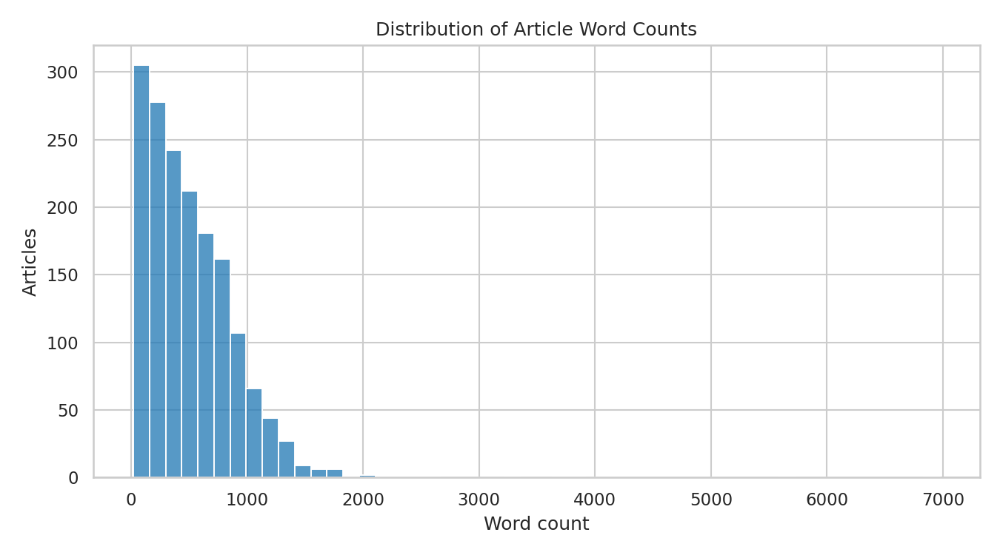
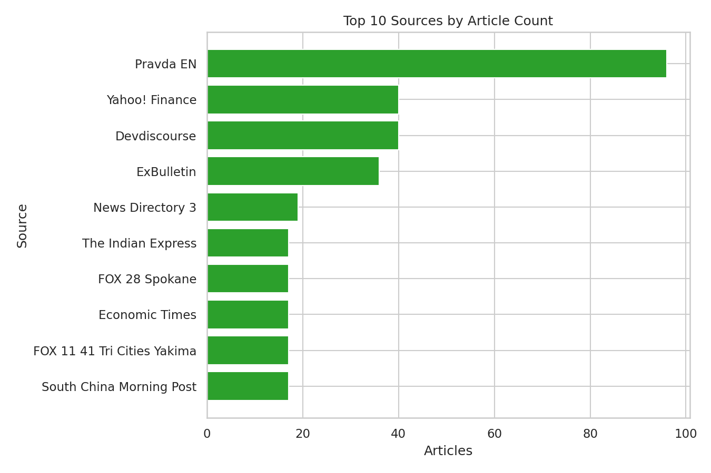
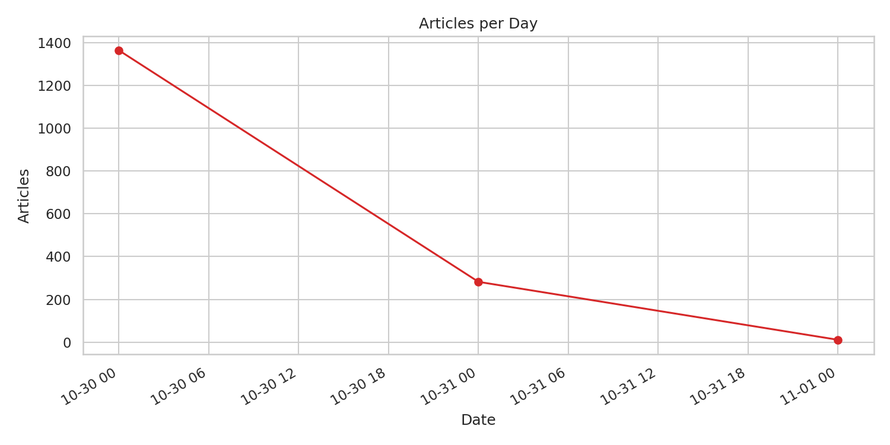

# Basic Stats Report

- Total articles: 1657
- Output CSV with word counts: `trump_xi_meeting_fulltext_with_wordcount.csv`

## Word count summary

| metric | value |
|---|---:|
| min | 18 |
| 25% | 215 |
| median | 437 |
| 75% | 732 |
| 90% | 1001 |
| 95% | 1180 |
| max | 6973 |
| mean | 520.08 |

### Histogram of word counts

## Top sources

| source | articles |
|---|---:|
| Pravda EN | 96 |
| Devdiscourse | 40 |
| Yahoo! Finance | 40 |
| ExBulletin | 36 |
| News Directory 3 | 19 |
| Economic Times | 17 |
| South China Morning Post | 17 |
| FOX 11 41 Tri Cities Yakima | 17 |
| FOX 28 Spokane | 17 |
| The Indian Express | 17 |

## Articles per day

